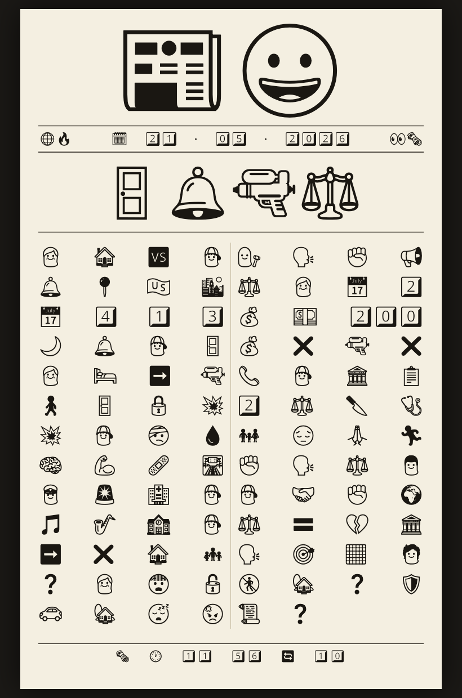

# newsmoji

The single hottest news story, retold **entirely in emoji**, laid out like a
newspaper front page.

<p align="center">
  
</p>

## What it does

`newsmoji.py` runs one cycle, end to end:

1. **Fetches** a basket of major-outlet RSS feeds into a pooled story list.
2. **Picks** - Anthropic call #1 (Claude Sonnet) chooses the single hottest
   story, skipping ones it covered in the last few editions, and renders the
   headline as a short emoji glyph.
3. **Reads** the chosen story's full article body from the outlet's page
   (JSON-LD `articleBody`, with a `<p>`-scraping fallback).
4. **Translates** - Anthropic call #2 (Claude Sonnet) retells the whole story
   as a tight emoji narrative (a hard 70-140 emoji).
5. **Renders** a single self-contained `index.html`: a portrait-broadsheet
   newspaper - emoji masthead, lead emoji, the emoji story in newsprint
   columns - auto-sized to fit the screen with no scrolling, and set to
   reload itself every 10 minutes. The page is 100% emoji - not one word of
   text anywhere - rendered black-on-newsprint in a monochrome emoji font.

Run it on a schedule (say a `*/10` cron) and you have a news page that keeps
refreshing itself with the latest story.

## Running it

```sh
export ANTHROPIC_API_KEY=sk-ant-...     # a pay-as-you-go console key
python3 newsmoji.py
```

Pure Python standard library - no pip, no venv. One cycle makes two
Anthropic API calls (pick + translate) plus one article-page fetch. The API
key can instead live in `newsmoji.env` (a `KEY=VALUE` file) in the state
directory.

## Output & state

Everything lives in the **state directory** - `~/newsmoji/` by default,
override with `NEWSMOJI_STATE_DIR`:

| File | What |
|------|------|
| `index.html`   | the rendered page - this is the output |
| `newsmoji.log` | verbose per-cycle log, self-trimming at 5 MB |
| `history.json` | recently-covered stories, so the next pick won't repeat |
| `feeds.txt`    | optional - one RSS URL per line, replaces the default basket |

The page loads **`NotoEmoji-mono.woff`** (bundled in this repo) for its
monochrome look - serve that file alongside `index.html`.

## Robustness

The page never breaks. On any failure - a feed down, an API call failing, a
bad render - the cycle aborts and the last good `index.html` is left
untouched. Worst case the page is a little stale, never broken or blank.

## Configuration

| Variable | Default | Purpose |
|----------|---------|---------|
| `ANTHROPIC_API_KEY` | (or from `newsmoji.env`) | Anthropic API key |
| `NEWSMOJI_STATE_DIR` | `~/newsmoji` | state + output directory |

## License

GPLv3 - see [`LICENSE`](LICENSE).

The bundled `NotoEmoji-mono.woff` is Google's **Noto Emoji**, used under the
SIL Open Font License 1.1.
